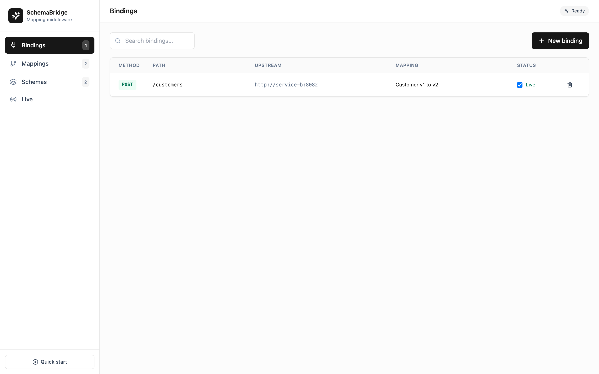
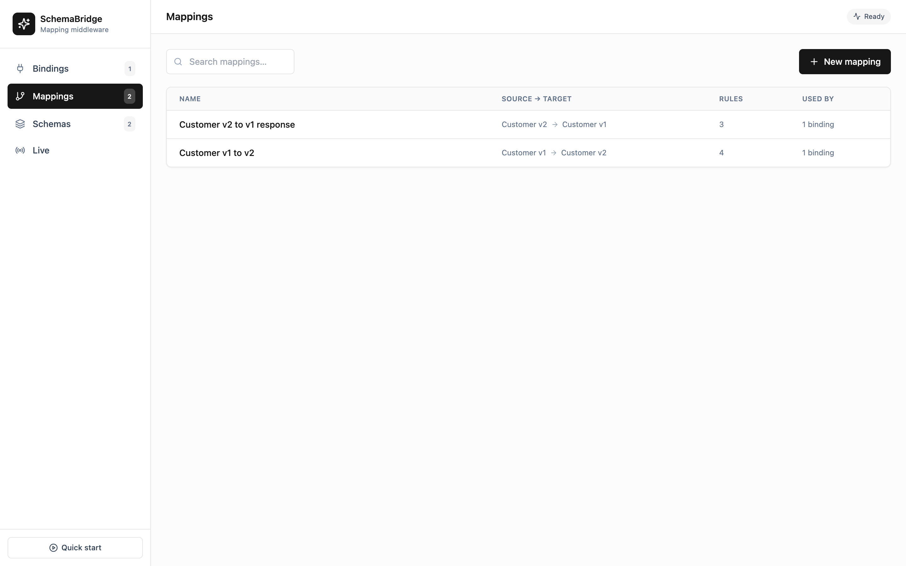
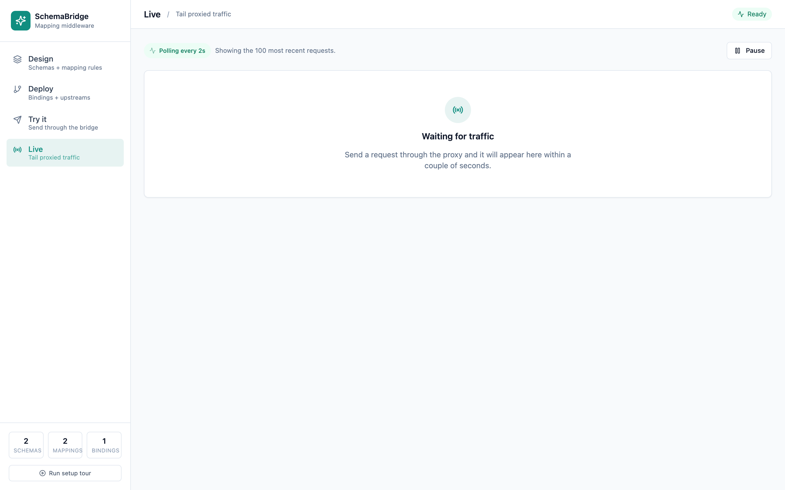
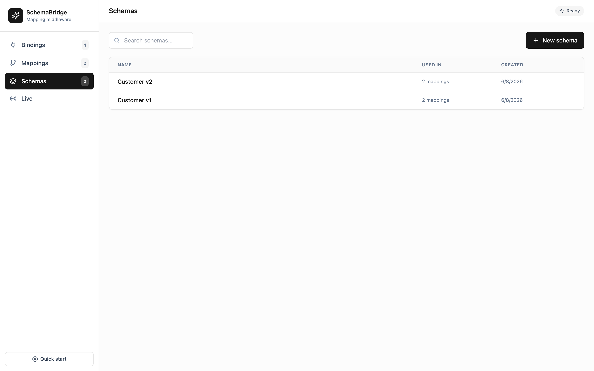
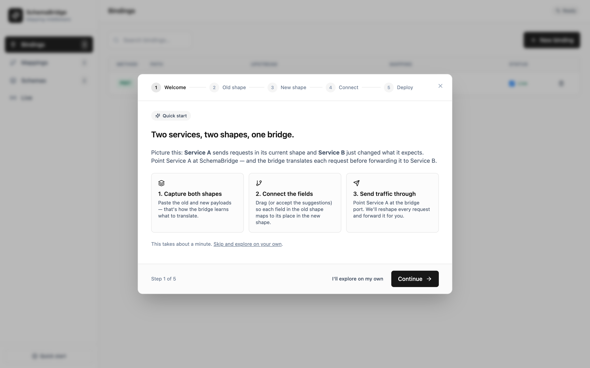

# SchemaBridge

[](https://github.com/Anis-Ghliss/SchemaBridge/actions/workflows/ci.yml)
[](LICENSE)

**Programmable mapping middleware for JSON-over-HTTP workflows.** Design payload transformations in a visual editor, then deploy them as runtime bindings — traffic hitting the bridge is reshaped in-flight and forwarded to the right upstream. Drop it anywhere JSON shapes don't agree.



The GUI is organized around the four things a team actually manages: **Bindings** (routes on the proxy), **Mappings** (the field-level rules), **Schemas** (the payload shapes), and **Live** (an observable tail of every proxied request). Each is its own searchable list with detail views — no linear flow forced on you when you have ten services and twenty mappings.




A **Quick start** modal in the sidebar walks new installs through capturing two shapes, suggesting field pairings, and deploying the first binding — then drops you on the new binding's page to send a test request.

## Why

Most teams hit the same problem at every integration boundary: two systems exchange JSON but disagree on the shape. The usual fix is to write adapter code in one service, then ship it again when the contract changes. SchemaBridge moves that work out of the codebase and into a live, configurable layer.

Use it for:

- **API version skew** — keep v1 endpoints alive while the backend speaks v2.
- **Anti-corruption layers** — translate sprawling legacy payloads into a clean internal shape before they reach modern services.
- **Multi-source ingestion** — normalize slightly different payloads from many producers into a single contract for one consumer.
- **Partner integrations** — accept third-party shapes at the edge without polluting your domain code.
- **Service mesh translation** — apply per-route shape adapters between microservices without touching either side.
- **API gateways / BFFs** — collapse the "write a tiny mapping function" task into a configuration change.

Each route is a `ProxyBinding`: method + path pattern + upstream URL + a mapping (and optionally a reverse mapping for the response). Bindings are independent, hot-reloaded on save, and there can be as many as you need — the bridge scales from "one service in front of another" to a fan-out hub that adapts dozens of routes into your stack.

## Drop into your stack

SchemaBridge ships as **one image**. Add it to your existing `docker-compose.yml` alongside whatever you already run; point your services at `bridge:8080`, configure routes in the GUI on `:4000`.

```yaml
services:
  schemabridge:
    image: ghcr.io/anis-ghliss/schemabridge:v0.1.6
    ports:
      - "8080:8080"   # runtime proxy — point your services here
      - "4000:4000"   # admin API + GUI
    environment:
      DATABASE_URL: postgres://app:${BRIDGE_DB_PASSWORD:?set in .env}@bridge-db:5432/schemabridge
      ADMIN_API_KEY: ${BRIDGE_ADMIN_KEY:?set in .env}
      PROXY_REQUIRE_AUTH: "true"
    restart: on-failure
    depends_on: [bridge-db]

  bridge-db:
    image: postgres:16-alpine
    environment:
      POSTGRES_USER: app
      POSTGRES_PASSWORD: ${BRIDGE_DB_PASSWORD:?set in .env}
      POSTGRES_DB: schemabridge
    volumes:
      - schemabridge-data:/var/lib/postgresql/data
    restart: on-failure

volumes:
  schemabridge-data:
```

Open <http://localhost:4000>, create a binding, then send traffic to `http://localhost:8080/<your-path>`.

New users should follow [Getting Started](docs/getting-started.md) for a blank-database order mapping scenario.

### Environment

| Variable | Default | Purpose |
| --- | --- | --- |
| `DATABASE_URL` | — (required) | Postgres connection string |
| `PORT` | `4000` | Admin API + GUI port |
| `PROXY_PORT` | `8080` | Runtime proxy port |
| `CORS_ORIGIN` | `*` | CORS allow-list for the admin API |
| `PROXY_REQUIRE_AUTH` | `false` | When `true`, the proxy rejects requests without a valid `Authorization: Bearer <key>` belonging to a registered app |
| `ADMIN_API_KEY` | unset | When set, the admin API/GUI require `Authorization: Bearer <key>`. Leave unset for local dev; set it in any deployed environment. |
| `PROXY_REQUEST_LOG_RETENTION_DAYS` | unset | Optional retention window for `ProxyRequestLog`; when set to a positive number, old rows are deleted at startup and then daily. |
| `ADMIN_BODY_LIMIT_BYTES` | `1048576` | Max JSON body size accepted by the admin API. |
| `PROXY_BODY_LIMIT_BYTES` | `1048576` | Max JSON body size accepted by the runtime proxy. |
| `PROXY_UPSTREAM_TIMEOUT_MS` | `30000` | Upstream header/body timeout for proxied requests. |
| `ADMIN_RATE_LIMIT_MAX` | `600` | Max admin requests per client per window; set `0` to disable. |
| `ADMIN_RATE_LIMIT_WINDOW_MS` | `60000` | Admin rate-limit window size. |
| `PROXY_RATE_LIMIT_MAX` | `1200` | Max proxy requests per client per window; set `0` to disable. |
| `PROXY_RATE_LIMIT_WINDOW_MS` | `60000` | Proxy rate-limit window size. |
| `TRUST_PROXY` | `false` | When `true`, rate limiting reads the client IP from `X-Forwarded-For`. Only enable behind a reverse proxy that overwrites this header — otherwise clients can spoof it to evade rate limits. |
| `PROXY_ALLOW_PRIVATE_UPSTREAMS` | `true` | When `false`, bindings/requests to loopback and private (RFC 1918 / ULA) upstreams are rejected. Link-local / cloud-metadata addresses and non-HTTP schemes are **always** blocked regardless of this setting. |
| `PROXY_UPSTREAM_ALLOWLIST` | unset | Comma-separated `host` or `host:port` allowlist. When set, bindings/requests may only target these upstreams. |
| `PROXY_LOG_BODIES` | `true` | When `false`, request/response bodies are not persisted to `ProxyRequestLog` (metadata only). Set `false` when traffic carries PII/secrets. |
| `BRIDGE_ALLOW_INSECURE` | `false` | When `true`, allows the bridge to start in production even if `ADMIN_API_KEY`/`PROXY_REQUIRE_AUTH` are unset. Otherwise such a config is fatal in production. |
| `DRIFT_SAMPLE_RATE` | `1` | Fraction (0–1) of proxied requests passively checked for contract drift against each binding's schemas. Set lower to reduce overhead on high-traffic bridges; `0` disables drift detection. |

### Production checklist

Before pointing real traffic at the bridge:

- [ ] **Pin the image** to a release tag (e.g. `:v0.1.6`), not `:latest`.
- [ ] Set `ADMIN_API_KEY` to a long, random secret — anyone reaching `:4000` with this token can create/edit bindings.
- [ ] Set `PROXY_REQUIRE_AUTH=true` and register one app per calling service in the **Apps** tab (Bearer key shown once on creation; rotate via the same tab).
- [ ] Set a real Postgres password.
- [ ] Mount a persistent volume on the Postgres data directory so mappings survive container recreate.
- [ ] Put the bridge behind a TLS-terminating reverse proxy (nginx/Caddy/Traefik). The bridge itself only speaks HTTP.
- [ ] Tune `PROXY_BODY_LIMIT_BYTES`, `PROXY_UPSTREAM_TIMEOUT_MS`, and proxy/admin rate limits for your traffic profile.
- [ ] Set `PROXY_REQUEST_LOG_RETENTION_DAYS` to the number of days of proxy traffic history you need, or run your own retention job.

When `NODE_ENV=production`, the bridge **refuses to start** if `PROXY_REQUIRE_AUTH` is not `true` or `ADMIN_API_KEY` is unset, so it cannot accidentally come up unauthenticated. Set `BRIDGE_ALLOW_INSECURE=true` to override (the misconfiguration is then logged as a warning instead). Outside production these remain warnings only.

### Authorizing services

In any non-local deployment, set `PROXY_REQUIRE_AUTH=true` and register one app per calling service in the **Apps** tab. Each app gets a `sb_…` API key (shown once on creation — copy it to a vault, you can rotate later). Scope each app to "all bindings" or a specific subset.

```bash
curl -X POST http://localhost:8080/customers \
  -H 'authorization: Bearer sb_yourKeyHere' \
  -H 'content-type: application/json' \
  -d '{"customerName":"Ada"}'
```

Disabled apps and out-of-scope routes return `403`; missing or unknown keys return `401`. Every proxied request is attributed to the app that authorized it in the Live traffic tab.

## Run Locally

Start SchemaBridge with a blank Postgres database:

```bash
docker compose up --build
```

- GUI + Admin: <http://localhost:4000>
- Runtime proxy: <http://localhost:8080>

From there, create your first real route:

1. Create a source schema from a representative incoming JSON payload.
2. Create a target schema from the JSON shape your destination service expects.
3. Create a mapping and connect fields explicitly.
4. Create a binding with the proxy path and destination service URL.
5. Register an app key if `PROXY_REQUIRE_AUTH=true`, then send traffic to `http://localhost:8080/<your-path>`.

Detailed walkthroughs:

- [Getting started](docs/getting-started.md)
- [Concepts](docs/concepts.md)
- [Validation](docs/validation.md)
- [Release checklist](docs/release-checklist.md)

## Screenshots

| Schemas | Quick start |
| --- | --- |
|  |  |

## How it works

```
client ──HTTP──►  proxy :8080  ──►  match ProxyBinding  ──►  apply request mapping
                                                              ├─► forward via undici
                                                              │      to upstreamBaseUrl + path
                                                              ◄── upstream response
                                                              └─► apply response mapping (optional)
                                                              ──► return to client

GUI    ──HTTP──►  admin :4000  ──►  CRUD: schemas / mappings / bindings
                                    │
                                    └─► live reload of proxy on every save
```

Two Fastify instances in one Node process share a Prisma client into Postgres. Mappings are versioned; restoring an old version updates the live route without redeploying.

## Mapping rules

Each rule is `sourcePath → targetPath` with dot-notation paths (supports array indexes). Optional fields:

- `defaultValue` — used when the source path is missing.
- `transform` — small coercion enum: `string` · `number` · `boolean` · `lowercase` · `uppercase` · `iso-date`.

The transformation engine is framework-neutral and lives in `packages/transformation-engine`, so the same rules drive the GUI preview, the runtime proxy, and any future workers or CLI tools.

## Runtime validation

Each binding can validate payloads against the example schemas attached to its request and optional response mappings:

- `off` — default; preserve current best-effort transformation behavior.
- `warn` — forward traffic, but record validation errors in the Live traffic log.
- `strict` — reject invalid inbound payloads with `400`; reject invalid transformed or upstream payloads with `502`.

Validation is example-derived and intentionally lightweight: fields present in the saved schema example are treated as required with matching JSON types, while extra fields are allowed.

## Workspace

- `apps/frontend` — React + Vite GUI (3-tab shell: Design / Deploy / Try it)
- `apps/backend` — Fastify admin API on `:4000` and proxy on `:8080`, single process
- `packages/shared-types` — Zod contracts shared by GUI and API
- `packages/schema-parser` — JSON-example to field-tree parser
- `packages/transformation-engine` — payload transformer (path rename + transform enum)
- `docs` — architecture, API (OpenAPI), local setup, roadmap

## Verification

```bash
npm install
npm run lint
npm run test
npm run build
```

## Roadmap highlights

See `docs/roadmap.md` for the full list. Near-term bets: a full expression language (jsonata/jq) for rules beyond simple renames, observability for proxied traffic, OpenAPI ingestion, and AI-assisted mapping suggestions.
