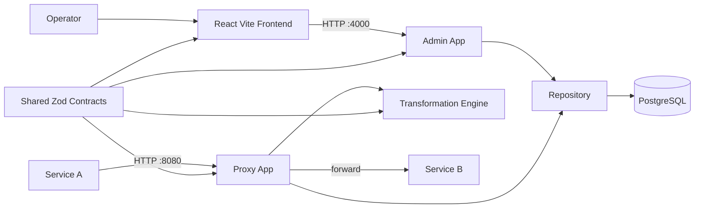

# Architecture



## Modules

- `apps/frontend`: operator GUI — schema input, mapping canvas, version controls, runtime bindings panel, proxy probe.
- `apps/backend`: single Node process exposing two Fastify instances — admin/CRUD on `PORT` (default 4000) and the runtime proxy on `PROXY_PORT` (default 8080).
- `packages/shared-types`: Zod contracts and TypeScript types.
- `packages/schema-parser`: converts JSON examples into path trees.
- `packages/transformation-engine`: applies mapping rules (path rename + optional `transform` enum: string/number/boolean/lowercase/uppercase/iso-date).
- `examples/services`: tiny upstreams used by the `demo` compose profile.
- `examples/seed`: seed file loaded on first boot when `BINDINGS_SEED_FILE` is set.

## Database Schema

The Prisma schema is in `apps/backend/prisma/schema.prisma`.

```prisma
model SchemaDocument {
  id        String   @id @default(uuid())
  name      String
  content   Json
  fields    Json
  createdAt DateTime @default(now())

  sourceMappings Mapping[] @relation("SourceSchema")
  targetMappings Mapping[] @relation("TargetSchema")
}

model Mapping {
  id             String           @id @default(uuid())
  name           String
  sourceSchemaId String
  targetSchemaId String
  currentVersion Int              @default(1)
  createdAt      DateTime         @default(now())
  updatedAt      DateTime         @updatedAt
  sourceSchema   SchemaDocument   @relation("SourceSchema", fields: [sourceSchemaId], references: [id], onDelete: Cascade)
  targetSchema   SchemaDocument   @relation("TargetSchema", fields: [targetSchemaId], references: [id], onDelete: Cascade)
  versions       MappingVersion[]
}

model MappingVersion {
  id        String   @id @default(uuid())
  mappingId String
  version   Int
  rules     Json
  createdAt DateTime @default(now())
  mapping   Mapping  @relation(fields: [mappingId], references: [id], onDelete: Cascade)

  @@unique([mappingId, version])
}
```
